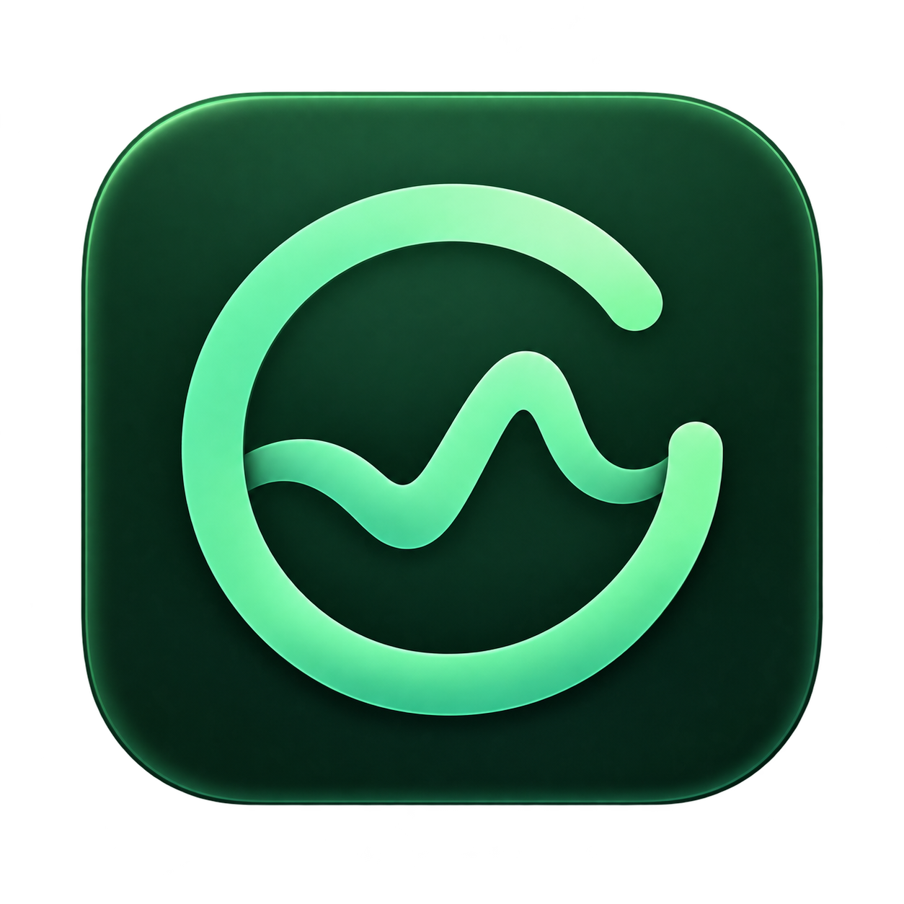
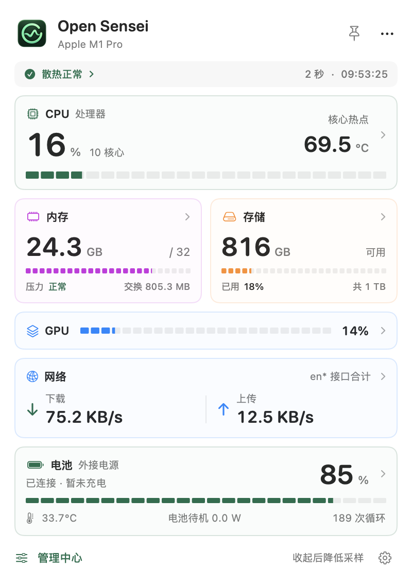
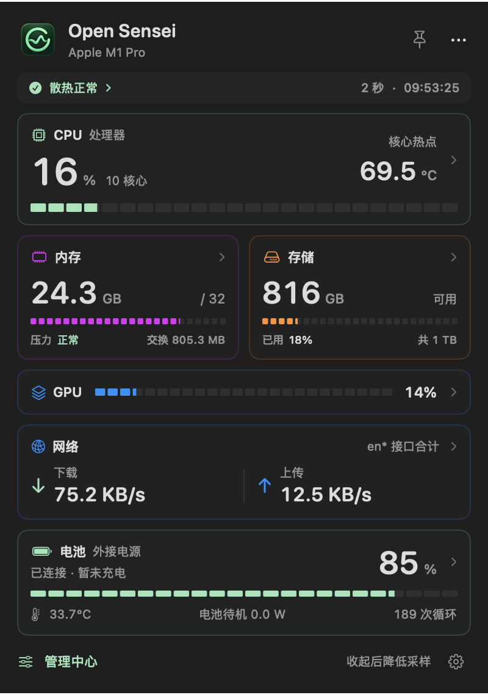

<p align="center"></p>
<h1 align="center">Open Sensei</h1>
<p align="center">A lightweight, local-first Mac system monitor and maintenance app.</p>
<p align="center"><a href="README.zh-CN.md">简体中文</a> · <a href="https://github.com/asdfghklddd/open-sensei/releases/latest">Download DMG</a> · <a href="LICENSE">MIT license</a></p>

Open Sensei is a native **SwiftUI + AppKit** menu-bar app for understanding your Mac's CPU, memory, battery, cooling, network, and storage. Open a quick popover, pin a floating panel, collapse it to the screen edge, or use the full management window.

**macOS 14+ · Apple Silicon release · no subscription · no telemetry · no third-party runtime**

The current interface is primarily Chinese. This repository provides English and Chinese documentation; a fully localized English interface is not included yet. This is an independent project, unaffiliated with Cindori Sensei or coconutBattery.

## Install

1. Download `Open-Sensei-1.2.3-arm64.dmg` and `SHA256SUMS` from [Releases](https://github.com/asdfghklddd/open-sensei/releases/latest).
2. Open the DMG and drag **Open Sensei.app** onto **Applications**.
3. Eject the DMG and launch the app from Applications. The management window opens immediately. Click the menu-bar icon for the compact monitor; **⌘0** also opens the management window.

Quit the running copy before replacing the app. Closing the management window keeps the menu-bar monitor running; opening the app again brings the window back.

The release is **ad-hoc signed, not Developer ID notarized**. Gatekeeper may require your approval in System Settings → Privacy & Security. Verify the source and checksum before opening. No Python, Node, terminal, or developer tools are required to run the packaged app. See [installation notes](docs/INSTALL.txt).

```sh
# Run in the folder containing the downloaded DMG and SHA256SUMS.
shasum -a 256 -c SHA256SUMS
```

## Features

| Area | What you can do |
| --- | --- |
| System monitor | CPU, GPU where available, memory pressure and composition, swap, available storage, and network rates |
| Menu bar and panels | Choose the menu-bar metric, reorder panel modules, pin a floating panel, or collapse it to an edge |
| Battery | Charge, cycles, remaining/full/design capacities, temperature, voltage, signed current, and net battery power |
| Power input | Distinguish adapter capability, actual input power, and power entering or leaving the battery |
| Battery deep report | System health, controller details, lifetime temperature/voltage statistics, peak currents, operating hours, and bank Qmax where exposed |
| Cooling | Temperature sensors, live fan RPM, and temporary fixed-speed or temperature-curve sessions |
| Activity and diagnosis | Per-interface network traffic, disk activity, on-demand process sampling, and contextual state checks |
| Storage tools | Bounded folder scans, selected files moved to Trash, app removal with matched support files, SMART/TRIM and volume reports, and a one-shot disk benchmark |
| Reports and alerts | Preview/copy status reports; print battery reports; optional low-charge, remaining-time, memory-pressure, and free-space alerts |

### Compact control panel

The menu-bar panel uses compact metric rows. CPU and network mini trends sit beside their live values. Memory shows App, wired, compressed and swap use; storage and GPU use small capacity/load bars; battery exposes power, temperature, voltage and cycles. Each row opens its corresponding management page. The top strip shows macOS thermal pressure, sampling cadence and the last update time.

The complete default panel measures 400 × 406 points, about 29% shorter than the 400 × 569 panel in 1.2.1. Reduced padding and inline layouts make room for more readings and small trends. The same bounded histories and sampling schedule are reused, with no additional hardware polling or animation timer.

<p> </p>

*Layout previews use illustrative readings, not a live hardware report.*

### Charts with a purpose

Charge and storage rings, memory composition, capacity comparison bars, a locally zoomed cell-bank voltage plot, lifetime temperature ranges, and optional daily capacity bars complement CPU/network/temperature trends. Brief view transitions respect Reduce Motion, Low Power Mode, and elevated thermal pressure. Charts have no continuous animation timers.

### Battery readings, explained

- **macOS maximum capacity** and **nominal full capacity ÷ design capacity** use different definitions and are shown separately.
- Lifetime statistics come from the battery controller. You do not need to run this app for months to collect them.
- macOS 27 Pack/Bank child services and older root fields are supported by the parser. Actual availability depends on hardware and firmware.
- Qmax is a learned chemical-capacity estimate; series-bank capacities must not be added together. Voltage differences are observations, not cell-health scores.
- Manufacturing month is shown only for a validated encoding and labeled as inferred. Randomized device serial numbers are not decoded.
- Unknown, implausible, or ambiguous readings remain unavailable. Remaining-time sentinel values are rejected.

The app covers the main **Mac battery** use cases described by [coconutBattery](https://www.coconut-flavour.com/coconutbattery/), including core readings and supported lifetime fields. It does not include iPhone/iPad connectivity, custom HTML print templates, or complete SSD lifetime read/write statistics. This is a feature comparison against public documentation, not a claim of identical hardware coverage.

## Low overhead and limited storage

| Situation | Default behavior |
| --- | --- |
| Visible monitor | 2-second sampling, restricted to the visible page's needs |
| Closed, covered, or minimized | Only the selected menu-bar metric, normally every 30 seconds |
| Low Power Mode / elevated heat | Visible sampling at least 5 seconds; background at least 60 seconds |
| Sleep / display sleep | Periodic monitoring pauses |
| Deep reports, processes, scans, benchmarks | Run only when requested; cancel/release results when the window closes |
| Icon-only menu, history and alerts disabled | No periodic sampling |

Disk capacity is read at most once per minute, cell voltages at most every 10 seconds, and battery temperature at most every 5 seconds outside the cooling page. Temporary fan sessions have independent protection checks.

**No network requests, raw telemetry logs, or database.** Live trends retain at most 60 points per series in RAM and clear when monitoring surfaces close. Settings use macOS preferences. The only optional history is a daily battery-capacity summary: **off by default, at most 90 entries and 64 KiB**. Its path is `~/Library/Application Support/OpenSensei/battery-daily.json`; it can be cleared in Settings.

Scans have time/entry/result limits. The disk benchmark uses a temporary 32 MiB file that is unlinked immediately and released when its descriptor closes. No automatic full-disk cleanup runs.

## Fan control

Based on the MIT-licensed SMC implementation from [asdfghklddd/fanctl](https://github.com/asdfghklddd/fanctl). Only a manually started, temporary control session requests administrator authorization. There is no installed privileged daemon, saved password, or persistent root service.

Sessions include a deadline, heartbeat checks, temperature protection, write verification, and automatic-mode restoration. Stop with **⌘.** or the restore button. The curve smooths temperature and slows down gradually. Hardware support varies; the release has been physically tested on **M1 Pro / macOS 27**, not every Mac. See [validation scope](VALIDATION.md) and [third-party notices](THIRD_PARTY_NOTICES.txt).

## Build from source

Use a Mac with Xcode or compatible Swift developer tools. The package targets macOS 14; Swift tools version is 5.9. There are no external Swift package dependencies.

```sh
git clone https://github.com/asdfghklddd/open-sensei.git
cd open-sensei
./scripts/build.sh
./scripts/package-dmg.sh
```

The build uses the checked-in PNG artwork, ImageIO, and macOS `iconutil`. Output: `build/Open Sensei.app`; DMG and checksum: `dist/`. The binary uses the build machine's architecture; the published release is arm64. The packaging script refuses to overwrite an existing DMG.

```sh
CLANG_MODULE_CACHE_PATH="$PWD/.build/clang-cache" swift test --disable-sandbox
./scripts/test-helper.sh
```

Helper integration tests use a fake SMC backend and do not change real fan speeds. [Contributing](CONTRIBUTING.md) explains the layout and checks.

## Release 1.2

- Original AI-generated app identity, packaged as a standard macOS ICNS icon.
- Drag-and-drop DMG, SHA-256 checksum, and bilingual documentation.
- Includes the 1.1 battery analysis, report printing, chart, and sampling improvements.

The release is local/ad-hoc signed; cross-machine compatibility and notarization remain future work. The native dark battery interface was rechecked for this release. Current test coverage and performance methodology are summarized in [VALIDATION.md](VALIDATION.md).

## License and references

MIT — see [LICENSE](LICENSE). Included SMC attribution is preserved in [THIRD_PARTY_NOTICES.txt](THIRD_PARTY_NOTICES.txt). Battery field locations/semantics were researched using [WhatBattery](https://github.com/darrylmorley/whatbattery); no dependency was added. Icon generation provenance and the prompt are in [assets/README.md](assets/README.md).
